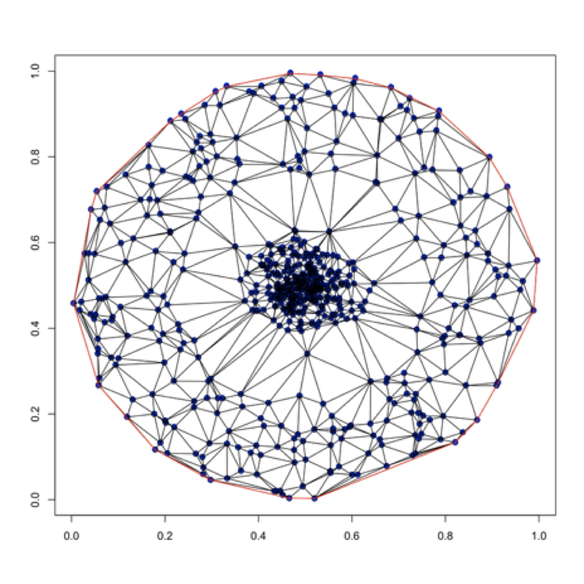
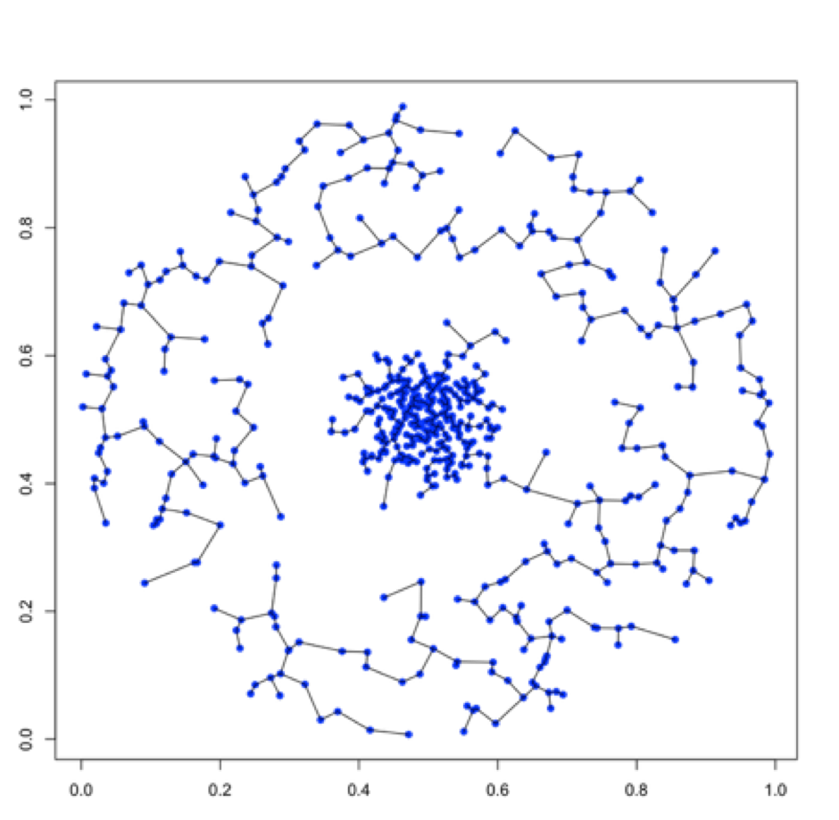

[](http://quantlet.de/)

## [](http://quantlet.de/) **SCGEye** [](http://quantlet.de/)

```yaml

Name of Quantlet: SCGEye

Published in: SCG_Scagnostics

Description: "Calculates and plots the Minimum Spanning Tree and the Delaunay Triangulation for the 'Eye distribution', as well as the histogram and Boxplot of the edges lengths of the Scatter Plot"

Keywords: 'scagnostics, scatterplot, Delaunay Triangulation, Minimum Spanning Tree, Eye distribution'

Author: Ioana Ceausu

Submitted:  Monday, January 2019 by Ioana Ceausu


```



